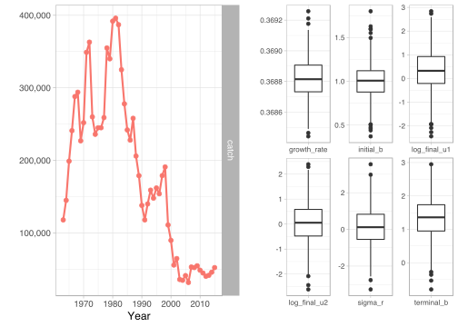
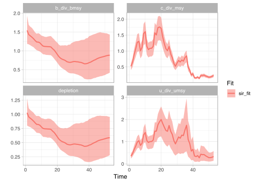
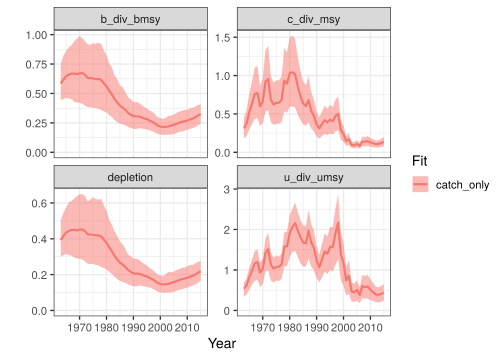
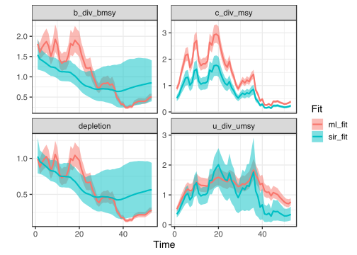

# sraplus

[](https://travis-ci.org/DanOvando/sraplus)
<!-- README.md is generated from README.Rmd. Please edit that file -->

**THIS PACKAGE IS UNDER ACTIVE DEVELOPMENT AND SHOULD NOT BE USED FOR
INDIVIDUAL STOCK ASSESSMENT AT THIS TIME**

`sraplus` is a flexible assessment package based around Ovando et
al. 2019. At the most “data limited” end, the model approximates the
behavior of catch-msy, sampling from prior distributions to obtain
parameter values that given a catch history do not crash the population
and are match supplied priors on initial and final depletion. At the
most data rich end the model the model can fit to an abundance index
with priors on fishing mortality over time and initial and final
depletion.

## Installing

This is an in-development package hosted on github, so you will need to
do a few things to install it.

1.  open R

2.  If you don’t have the `devtools` package installed yet, run

<!-- end list -->

``` r
install.packages("devtools")
```

You’ll need to be connected to the internet.

3.  Once `devtools` has been installed, you can then install `sraplus`
    by running

<!-- end list -->

``` r
devtools::install_github("danovando/sraplus")
```

That’s probably going to ask you to install many other packages, agree
to the prompts.

### Troubleshooting

Make sure you try the install with a fresh R session (go to
“Session\>Restart R” to make sure)

If you run into an error, first off try updating your R packages. From
there….

If your version of R is lower than 3.5, you might want to consider
updating R itself. Updating from 3.3 to 3.5 shouldn’t be any hassle. BIG
WARNING THOUGH, updating from say R 2.9 to 3.5 is a major update, and
you’ll lose all your installed packages in the process. I recommend
following the instructions
[here](https://www.datascienceriot.com/r/upgrade-R-packages/) to deal
with that, but even with that fix it can take a while, so I don’t
recommend doing a major R update if you’re on a deadline.

From there…

  - On Windows, make sure you have the appropriate version of Rtools
    installed ([here](https://cran.r-project.org/bin/windows/Rtools/)),
    most likely Rtools35 if you have R version 3.3 or higher
      - Make sure that you select the box that says something about
        adding Rtools to the PATH variable
  - On macOS, there might be some issues with the your compiler. If you
    get an error that says something like `clang: error: unsupported
    option '-fopenmp'`, follow the instructions
    [here](https://thecoatlessprofessor.com/programming/r-compiler-tools-for-rcpp-on-macos/)

Once you’ve tried those, restart your computer and try running

``` r

install.packages("devtools")

devtools::install_github("danovando/sraplus")
```

again

## SIR example

Once you’ve successfully installed `sraplus` you can take for a test
drive with these examples.

For the first example we’ll run use a sampling-importance-resampling
(SIR) algorithm, using fisheries management index scores and swept area
ratio data to provide priors on B/Bmsy and U/Umsy in the final year

``` r

library(sraplus)
library(ggplot2)
library(dplyr)

example_taxa <- "gadus morhua"

data(cod)

driors <- format_driors(
  taxa = example_taxa,
  catch = cod$catch,
  years = cod$year,
  initial_b = 1,
  initial_b_sd = 0.2,
  terminal_b = 0.75,
  terminal_b_sd = 1,
  use_heuristics = FALSE,
  sar = 2,
  fmi = c("research" = 0.5,"management" = 0.8, "enforcement" = 0.75, "socioeconomics" = .67),
)

plot_driors(driors)
```

<!-- -->

``` r

sir_fit <- fit_sraplus(driors = driors,
                       engine = "sir",
                       draws = 1e6)

plot_sraplus(sir_fit = sir_fit)
```

<!-- -->

## Maximum Likelihood Example

We’ll now use maximum likelihood to fit to the same fishery, but now
using an index of abundance and a swept area ratio as a penalty on
U/Umsy in the final year

``` r

driors <- format_driors(
  taxa = example_taxa,
  catch = cod$catch,
  years = cod$year,
  index = cod$index,
  index_years = cod$year,
  initial_b = 1,
  initial_b_sd = 0.01,
  terminal_b = 0.5,
  sar = 2,
  sar_sd = 0.1
)

plot_driors(driors)
```

<!-- -->

``` r


ml_fit <- fit_sraplus(driors = driors,
                      engine = "tmb",
                      model = "sraplus_tmb")
```

And we can now compare the two results

``` r

plot_sraplus(sir_fit = sir_fit, ml_fit = ml_fit)
```

<!-- -->
