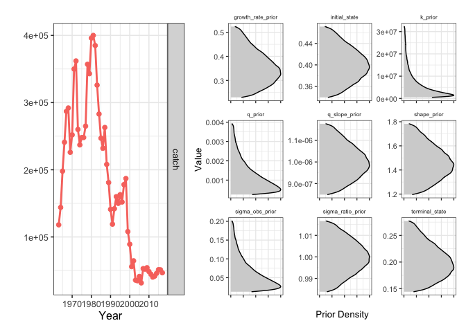
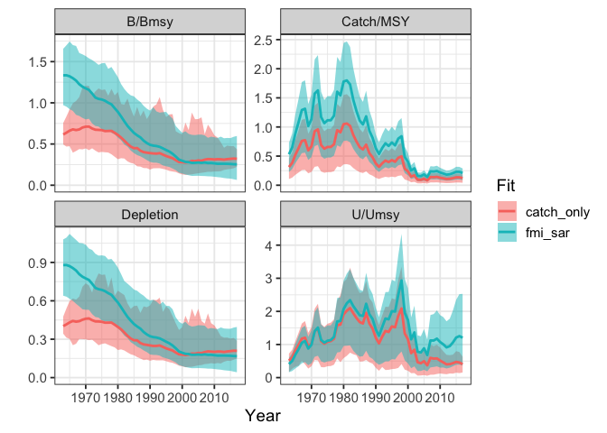
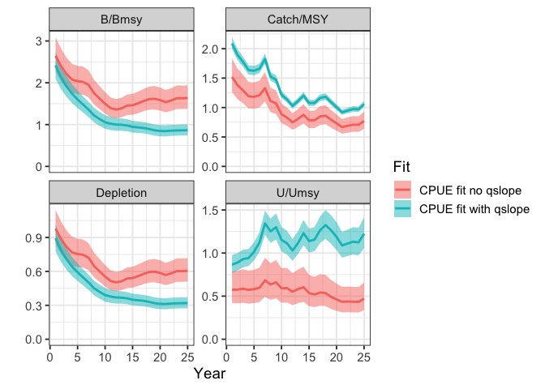
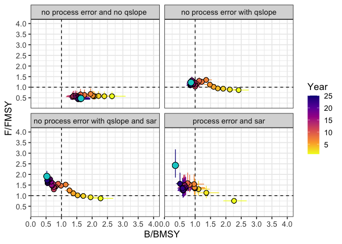
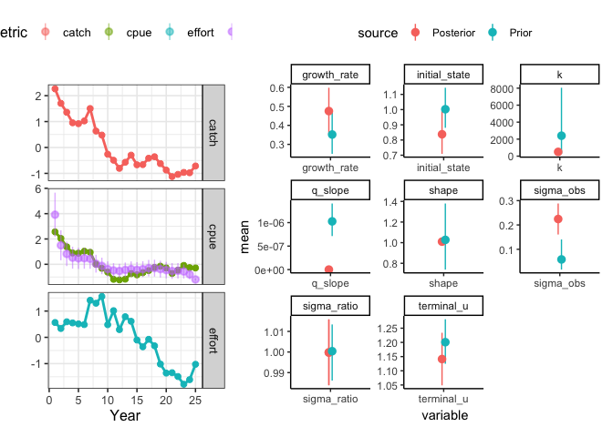

# sraplus

<!-- [](https://travis-ci.org/DanOvando/sraplus) -->
<!-- README.md is generated from README.Rmd. Please edit that file -->

`sraplus` is a flexible assessment package based developed in [Ovando et
al. 2021](https://onlinelibrary.wiley.com/doi/abs/10.1111/faf.12593) At
the most “data limited” end, the model approximates the behavior of
catch-msy, sampling from prior distributions to obtain parameter values
that given a catch history do not crash the population and satisfy
supplied priors on initial and final depletion. At the most data rich
end the model can be fit to an abundance index or catch-per-unit-effort
data, while incorporating priors on recent stock status based on
Fisheries Management Index (FMI) scores or swept-area ratio data.

## Installing

This is an in-development package hosted on GitHub, so you will need to
do a few things to install it.

1.  open R

2.  If you don’t have the `remotes` package installed yet, run

``` r
install.packages("remotes")
```

You’ll need to be connected to the internet.

3.  Once `remotes` has been installed, you can then install `sraplus` by
    running

``` r
remotes::install_github("danovando/sraplus")
```

That’s probably going to ask you to install many other packages, agree
to the prompts.

### Troubleshooting

Make sure you try the install with a fresh R session (go to
“Session\>Restart R” to make sure)

If you run into an error, first off try updating your R packages. From
there….

If your version of R is lower than 3.5, you might want to consider
updating R itself. Updating from 3.51 to 3.52 shouldn’t be any hassle.
BIG WARNING THOUGH, updating from say R 3.1 to 3.5 is a major update,
and you’ll lose all your installed packages in the process. I recommend
following the instructions
[here](https://www.datascienceriot.com/r/upgrade-R-packages/) to deal
with that, but even with that fix it can take a while, so I don’t
recommend doing a major R update if you’re on a deadline. There are also
packages to help you with this process, specifically
[`installR`](https://github.com/talgalili/installr/issues) for Windows
and [`updateR`](https://github.com/AndreaCirilloAC/updateR) for Mac.

From there…

-   On Windows, make sure you have the appropriate version of Rtools
    installed ([here](https://cran.r-project.org/bin/windows/Rtools/))
    -   Make sure that you select the box that says something about
        adding Rtools to the PATH variable
    -   See instructions
        [here](https://cran.r-project.org/bin/windows/Rtools/)
-   On macOS, there might be some issues with the your compiler. If you
    get an error that says something like
    `clang: error: unsupported option '-fopenmp'`, follow the
    instructions
    [here](https://thecoatlessprofessor.com/programming/r-compiler-tools-for-rcpp-on-macos/)

Once you’ve tried those, restart your computer and try running

``` r

install.packages("remotes")

remotes::install_github("danovando/sraplus")
```

# Example Use

Once you’ve successfully installed `sraplus` you can take for a test
drive with these examples. We’ll now work through a couple examples,
from simple to complex, of using `sraplus`

First, load `sraplus`

``` r
library(sraplus)
```

## “Catch-only” SIR model

For the first example we’ll use a sampling-importance-resampling (SIR)
algorithm with a “catch-only” version of the model. In this mode, we use
catch heuristics (in the manner of the @anderson2014 adaptation of
Catch-MSY). The catch-heuristics are if catch in the first year is less
than 70% of the maximum reported catch, we set an expectation of
depletion in the initial year of 70% of carrying capacity. Otherwise,
the expectation is 40% of carrying capacity. For final depletion, the
heuristic prior is if catch in the final year is greater than 50% of
maximum catch final depletion is assumed to be 60% of carrying capacity,
otherwise 40% of carrying capacity.

The first step in running `sraplus` is the `sraplus::format_driors`
(data and priors) function. In this case, we will use example data for
Atlantic cod (*Gadus morhua*) that is included in the `sraplus` package.

``` r

example_taxa <- "gadus morhua"

data(cod)

head(cod)
#> # A tibble: 6 × 56
#>   stockid   scien…¹ commo…²  year  catch stock…³ TBmsy…⁴ ERmsy…⁵ MSYbest TBmgt…⁶
#>   <chr>     <chr>   <chr>   <int>  <dbl> <chr>     <dbl>   <dbl>   <dbl>   <dbl>
#> 1 CODIIIaW… Gadus … Atlant…  1963 118000 Atlant… 971321.   0.455 267310. 436865.
#> 2 CODIIIaW… Gadus … Atlant…  1964 144000 Atlant… 971321.   0.455 267310. 436865.
#> 3 CODIIIaW… Gadus … Atlant…  1965 198000 Atlant… 971321.   0.455 267310. 436865.
#> 4 CODIIIaW… Gadus … Atlant…  1966 241000 Atlant… 971321.   0.455 267310. 436865.
#> 5 CODIIIaW… Gadus … Atlant…  1967 287000 Atlant… 971321.   0.455 267310. 436865.
#> 6 CODIIIaW… Gadus … Atlant…  1968 292000 Atlant… 971321.   0.455 267310. 436865.
#> # … with 46 more variables: ERmgtbest <dbl>, TBmsy <dbl>, SSBmsy <dbl>,
#> #   Nmsy <dbl>, MSY <dbl>, Fmsy <dbl>, ERmsy <dbl>, TBmgt <dbl>, SSBmgt <dbl>,
#> #   Fmgt <dbl>, ERmgt <dbl>, TB0 <dbl>, SSB0 <dbl>, M <dbl>, TBlim <dbl>,
#> #   SSBlim <dbl>, Flim <dbl>, ERlim <dbl>, b_v_bmsy <dbl>, u_v_umsy <dbl>,
#> #   exploitation_rate <dbl>, effort <dbl>, total_biomass <dbl>,
#> #   ss_biomass <dbl>, tsn <chr>, areaid <chr>, stocklong.y <chr>, region <chr>,
#> #   primary_country <chr>, primary_FAOarea <chr>, inmyersdb <chr>, …
```

From there, we’ll pass the catch data, and the years corresponding to
the catch data, to `format_driors`, and tell the model to use catch-msy
style heuristics by setting `use_hueristics = TRUE`. You’ll note that
`sraplus` prints a warning `use_hueristics = TRUE` reminding you that
any estimates of stock status are simply a transformation of your prior
beliefs expressed through the catch heuristics.

``` r


catch_only_driors <- format_driors(
  taxa = example_taxa,
  catch = cod$catch,
  years = cod$year,
  use_heuristics = TRUE
)
```

You can take a look at the information in the `catch_only_driors` object
by using `sraplus::plot_driors`

``` r

plot_driors(catch_only_driors)
```



From there, we pass the `driors` object to `sraplus::fit_sraplus`, and
plot the results using `sraplus::plot_sraplus`. The `engine` argument
specifies how the model will be fit. When not actually “fitting” to
anything (rather simply sampling from priors that don’t crash the
population), we recommend setting engine to “sir”. The `draws` argument
tells `sraplus` how many draws from the SIR algorithm to generate, and
`n_keep` how many draws to sample from the total `draws` iterations. So
in this case the SIR algorithm will run 1 million iterations, and sample
2000 entries from those million in proportion to their likelihood.

``` r

sfs <- purrr::safely(fit_sraplus)

 catch_only_fit <- fit_sraplus(driors = catch_only_driors,
                       engine = "sir",
                       draws = 1e5,
                       n_keep = 4000,
                       estimate_proc_error = TRUE, 
                       estimate_shape = TRUE,
                       max_time = Inf,
                       tune_prior_predictive = FALSE)
 
 sraplus::plot_sraplus(catch_only = catch_only_fit, years = catch_only_driors$years)
```


Running `fit_sraplus` always produces a list with two objects: `results`
and `fit`. `results` is (mostly) standardized across engines set of
summary outputs from the fitted model. This allows us to easily plot and
compare outputs from models fit using `sir`, TMB, or stan. The `fit`
object contains the actual fitted model, which will of course vary
dramatically depending on what engine was used.

Let’s take a quick look at the `results` object.

``` r

head(catch_only_fit$results)
#> # A tibble: 6 × 6
#>    year variable           mean           sd       lower        upper
#>   <dbl> <chr>             <dbl>        <dbl>       <dbl>        <dbl>
#> 1  1963 b_div_bmsy        0.606       0.0679       0.485        0.729
#> 2  1963 b           4790800.    3456301.     2282987.    10659649.   
#> 3  1963 c_div_msy         0.324       0.122        0.102        0.501
#> 4  1963 crashed           0           0            0            0    
#> 5  1963 depletion         0.399       0.0407       0.330        0.459
#> 6  1963 index_hat_t  243347.     236865.       24172.      560343.
```

`results` is organized as a dataframe tracking different variables over
years. `mean` is the mean value for a given variable, `sd` the estimated
standard deviation around the mean, and `lower` and `upper` being the
10th and 90th percentiles of the estimates.

You can access other variables from the raw `fit` object, though this is
not standardized by engine and so requires knowing how to for example
get outputs out of `stanfit` objects. In the `catch_only_fit`, the `fit`
object is the output of the SIR algorithm.

``` r
head(catch_only_fit$fit)
#>   variable year draw   value draw_id
#> 1      b_t 1963    1 4318547   76682
#> 2      b_t 1964    1 4281119   76682
#> 3      b_t 1965    1 4298052   76682
#> 4      b_t 1966    1 4433532   76682
#> 5      b_t 1967    1 4430503   76682
#> 6      b_t 1968    1 4495026   76682
```

From there, we can generate some standard plots of B/Bmsy (b_div_bmsy),
Catch/MSY, U/Umsy, and depletion over time using `plot_sraplus`.

``` r

sraplus::plot_sraplus(catch_only = catch_only_fit, years = catch_only_driors$years)
```


## Fisheries Management Index and Swept Area Ratio

Now suppose that we obtain some FMI and SAR data for this fishery. We
can use these values to provide updated priors on current fishing
mortality rates and stock status (see full report for details on how
this is accomplished). Note that the FMI and SAR values year are
entirely fictional and any resemblance to any real fishery is purely
coincidental!

You’ll notice that we now add a few more options to format_driors. We’ll
manually set priors on initial depletion, with a prior of initial
biomass equal to carrying capacity (`initial_state = 1`), with a
standard deviation of 0.2. We’ll explicitly tell the model not to use
catch heuristics (though you don’t always need to specify this, FALSE is
the default). We’ll then pass the `driors` a swept area ratio of 2
(`sar = 2`), and a named vector of FMI scores (where FMI scores range
from 0 to 1). Note that FMI scores should be obtained through the formal
FMI survey process and not made up on the spot. W

``` r

fmi_sar_driors <- format_driors(
  taxa = example_taxa,
  catch = cod$catch,
  years = cod$year,
  initial_state = 1,
  initial_state_cv = 0.25,
  use_heuristics = FALSE,
  sar = 10,
  fmi = c("research" = 0.5, "management" = 0.5, "socioeconomics" = 0.5, 'enforcement' = 0.5),
  sar_cv = NA,
  use_b_reg = FALSE,
  b_ref_type = "k")

# fmi_sar_driors <- format_driors(
#   taxa = example_taxa,
#   catch = cod$catch,
#   years = cod$year,
#   use_heuristics = FALSE,
#   initial_state = NA,
#   initial_state_cv = NA,
#   b_ref_type = "k",
#   use_catch_prior = TRUE
# )
# 


sraplus::plot_driors(fmi_sar_driors)
```


We’ll then fit and plot our model. Note that you can pass multiple
`sraplus` fits, and can name each run whatever you would like.

``` r
fmi_sar_fit <- fit_sraplus(
  driors = fmi_sar_driors,
  engine = "sir",
  draws = 1e6,
  n_keep = 4000,
  estimate_shape = TRUE,
  estimate_proc_error = TRUE
)

plot_sraplus(fmi_sar = fmi_sar_fit,
             catch_only = catch_only_fit,
             years = fmi_sar_driors$years)
```



You can also use the function `sraplus::diagnose_sraplus` to look at
some brief diagnostics of the model fit. Note that these diagnostics are
not exhaustive, and users should carefully assess the quality of any
model fits on their own as well. `diagnose_sraplus` will inform the user
whether `FishLife` found an exact match for the species, and provide
some summary diagnostics for each model type (SIR, TMB, or Stan). For
the SIR case, the diagnostics include the number of unique samples in
the posterior, and a plot of the mean terminal values as a function of
the number of unique samples used. n

``` r

sraplus::diagnose_sraplus(fit = fmi_sar_fit, driors = fmi_sar_driors )
#> $fishlife_match
#> [1] "fishlife matched supplied species"
#> 
#> $distinct_sir_draws
#> [1] 2034
#> 
#> $sir_convergence_plot
```


## Abundance Index via Maximum Likelihood

We’ll now try adding in some actual data to fit to. For illustration
purposes (and since we’re no longer using FMI/SAR data which can’t
really be simulated), we’ll use a simulated fishery. Let’s start with a
very simple example,using a simple fishery simulator built into
`sraplus`.

``` r

set.seed(42)
sim <-
  sraplus_simulator(
    sigma_proc = 0.05,
    sigma_u = 0,
    q_slope = 0,
    r = 0.4,
    years = 25,
    q = 1e-3,
    m = 1.01,
    init_u_umsy = 1
  )

# sim$pop %>% 
#   dplyr::select(year, depletion,catch, effort,u) %>% 
#   gather(metric, value, -year) %>% 
#   ggplot(aes(year, value)) + 
#   geom_point() + 
#   facet_wrap(~metric, scales = "free_y") + 
#   labs(y = "Value", x = "Year") + 
#   sraplus::theme_sraplus()
```

Now, let’s pretend that we have a perfect index of abundance, which is
just `biomass * 1e-3`. We pass indices to `srplus` inside
`format_driors` as `index` and `index_years`, where `index_years` is a
vector of the same length of `index` specifying which years index data
are available. Well now use Template Model Builder (TMB) to estimate
stock status based on this index of abundance. We’ll add in some priors
on the growth rate and the shape of the Pella-Tomlinson model (1.01
roughly corresponds to a Fox model, where Bmsy/K \~= 0.4). Note that we
now set `engine = "tmb"` to fit the model via maximum likelihood using
TMB.

``` r
index_driors <- format_driors(
  catch = sim$pop$catch,
  years = sim$pop$year,
  index = sim$pop$biomass * 1e-3,
  index_years = sim$pop$year,
  initial_state = 1,
  initial_state_cv = 0.005)

plot_driors(index_driors)
```


``` r

index_fit <- fit_sraplus(driors = index_driors,
                      engine = "tmb",
                      model = "sraplus_tmb", 
                      estimate_proc_error = FALSE)

plot_sraplus(index = index_fit,years = index_driors$years)
```


``` r

plot_prior_posterior(index_fit, index_driors)
```


Looks good, now let’s try something a bit trickier.

## Fit Bayesian CPUE model with `stan`

We’ll now simulate a fishery with random-walk effort dynamics,
increasing catchability, and process error.

``` r

set.seed(42)

sim <-
  sraplus_simulator(
    sigma_proc = 0.05,
    sigma_u = 0.05,
    q_slope = 0.025,
    r = 0.2,
    years = 25,
    q = 1e-3,
    m = 1.01,
    init_u_umsy = 0.75
  )

# sim$pop %>% 
#   select(year, depletion,catch, effort,u) %>% 
#   gather(metric, value, -year) %>% 
#   ggplot(aes(year, value)) + 
#   geom_point() + 
#   facet_wrap(~metric, scales = "free_y") + 
#   labs(y = "Value", x = "Year") + 
#   sraplus::theme_sraplus()
```

Now suppose we no longer have a perfect index of abundance, but instead
data on the catch and effort (CPUE!). But, there are a few problems with
these CPUE data. First, we know from the simulation that q is increasing
over time, so simply treating Catch/Effort as an index of abundance will
be biased (since a unit of effort in the past is not the same as a unit
of effort in the present). Second, we need to account for diminishing
returns from increasing amounts of effort, and in-season losses to
natural mortality. `sraplus` provides some support to these problems.
`sraplus` will estimate a q. If desired it allows the user to either
specify an assumed slope in catchability (where
),
or to attempt to estimate `qslope` directly. Second, given values of q
and qslope (and estimates of natural mortality either supplied by the
user or drawn from `FishLife`), `sraplus` uses the Baranov equation to
translate effort into an effective fishing mortality rate.

**One important note**. By default, `sraplus` includes estimation of
process error. When running a simplified CPUE like this, the model can’t
really handle estimating both process error and a q_slope_prior (since
the persistent trend in the CPUE values caused by the qslope can be
soaked into the process error or the qslope). So, you need to provide a
VERY imformative prior on the q_slope_prior parameter if you’re going to
try and estimate (i.e. fix the q_slope_prior parameter), or turn off
process error (inside `fit_sraplus` set `estimate_proc_error = FALSE`)
(the recommended option in this case).

By now the order of operations should be pretty familiar: pass things to
driors, then driors to fit_sraplus. In this case, instead of passing an
index, we pass effort data, and effort years.

Just to explore functionality of `sraplus`, we’ll fit the model using
Bayesian estimation through stan (`engine = "stan"`). We’ll compare two
versions, one trying to estimate qslope, and one not. Note that we can
pass standard `rstan` options to `fit_sraplus`.

``` r


cpue_driors <- format_driors(taxa = example_taxa,
                           catch = sim$pop$catch,
                           years = sim$pop$year,
                           effort = sim$pop$effort,
                           effort_years = sim$pop$year,
                           shape_prior = 1.01,
                           q_slope_prior = 0,
                           q_slope_prior_cv = 0.2)


cpue_fit <- fit_sraplus(driors = cpue_driors,
                             engine = "tmb",
                             model = "sraplus_tmb",
                             adapt_delta = 0.9,
                             max_treedepth = 10,
                             n_keep = 2000,
                             chains = 1, 
                             cores = 1,
                             estimate_qslope = FALSE)


cpue_qslope_driors <- format_driors(taxa = example_taxa,
                           catch = sim$pop$catch,
                           years = sim$pop$year,
                           effort = sim$pop$effort,
                           effort_years = sim$pop$year,
                           shape_prior = 1.01,
                           q_slope_prior = 0.025,
                           q_slope_prior_cv = 0.05)

cpue_qslope_fit <- fit_sraplus(driors = cpue_qslope_driors,
                             engine = "stan",
                             model = "sraplus_tmb",
                             adapt_delta = 0.9,
                             max_treedepth = 10,
                             n_keep = 1000,
                             chains = 1, 
                             cores = 1,
                             estimate_qslope = TRUE,
                             estimate_proc_error = FALSE)
```

``` r

plot_sraplus(`CPUE fit no qslope` = cpue_fit, `CPUE fit with qslope` =  cpue_qslope_fit, years = cpue_driors$years)
```



As a final step, we can try adding in some fictional SAR data to our
fake fishery, just to see how it works. We can weight the SAR data using
the `sar_cv` input. Leaving `sar_cv = NA` uses the srandard deviation
from the posterior predictive of the fitted relationahip between SAR and
U/Umsy contained in the model. In other words, setting `sar_cv = NA`
lets the data tell you how much weight to assign to the SAR data. You
can however overwrite this if desired and pass a stronger weight to the
SAR data if desired.

``` r
cpue_sar_qslope_driors <- format_driors(taxa = example_taxa,
                           catch = sim$pop$catch,
                           years = sim$pop$year,
                           effort = sim$pop$effort,
                           effort_years = sim$pop$year,
                           shape_prior = 1.01,
                           q_slope_prior = 0.025,
                           q_slope_prior_cv = 0.25,
                           f_ref_type = "f",
                           sar = 2,
                           sar_cv = 0.1)

cpue_sar_qslope_fit <- fit_sraplus(driors = cpue_sar_qslope_driors,
                             engine = "tmb",
                             model = "sraplus_tmb",
                             adapt_delta = 0.9,
                             max_treedepth = 10,
                             n_keep = 2000,
                             chains = 1, 
                             cores = 1,
                             estimate_qslope = TRUE,
                             estimate_proc_error = FALSE)

plot_sraplus(cpue_sar_qslope_fit, years = cpue_sar_qslope_driors$years)
```


And for good measure one more with SAR data and process error instead of
qslope

``` r

cpue_sar_proc_driors <- format_driors(taxa = example_taxa,
                           catch = sim$pop$catch,
                           years = sim$pop$year,
                           effort = sim$pop$effort,
                           effort_years = sim$pop$year,
                           shape_prior = 1.01,
                           q_slope_prior = 0,
                           q_slope_prior_cv = 0.25,
                           sar = 4,
                           sar_cv = .05,
                           f_ref_type = "f")

cpue_sar_proc_fit <- fit_sraplus(driors = cpue_sar_proc_driors,
                             engine = "tmb",
                             model = "sraplus_tmb",
                             adapt_delta = 0.9,
                             max_treedepth = 10,
                             n_keep = 2000,
                             chains = 1, 
                             cores = 1,
                             estimate_qslope = FALSE,
                             estimate_proc_error = TRUE)
```

``` r

plot_sraplus(`no process error and no qslope ` = cpue_fit, 
             `no process error with qslope` =  cpue_qslope_fit, 
             `no process error with qslope and sar` = cpue_sar_qslope_fit,
             `process error and sar` = cpue_sar_proc_fit,
             years = cpue_driors$years)
```


We can also use several built-in processing functions to display and
store the results

`plot_prior_posterior` displays the prior and posterior distributions
for selected parameters

``` r

plot_prior_posterior(cpue_sar_proc_fit, cpue_sar_proc_driors)
```



We can plot a summary of the most recent status estimates, along with
key outcomes such as MSY

``` r
summarize_sralpus(cpue_sar_proc_fit, output = "plot")
```



Or produce a summary table that can be saved to a .csv file.

``` r
knitr::kable(summarize_sralpus(cpue_sar_proc_fit, output = "table"), digits = 2) 
```

| variable        |   mean |    sd |  lower |  upper | year |
|:----------------|-------:|------:|-------:|-------:|-----:|
| sigma_proc      |   0.27 |  0.05 |   0.19 |   0.34 |    1 |
| sigma_obs       |   0.27 |  0.04 |   0.20 |   0.34 |    1 |
| log_sigma_ratio |  -0.01 |  0.05 |  -0.09 |   0.07 |    1 |
| sigma_ratio     |   0.99 |  0.05 |   0.91 |   1.07 |    1 |
| log_ihat        |   4.18 |  0.05 |   4.10 |   4.27 |   25 |
| log_b\_div_bmsy |  -1.33 |  0.14 |  -1.55 |  -1.10 |   25 |
| log_b           |   4.18 |  0.05 |   4.10 |   4.27 |   25 |
| log_depletion   |  -2.32 |  0.14 |  -2.54 |  -2.10 |   25 |
| log_u\_div_umsy |   1.22 |  0.16 |   0.96 |   1.49 |   25 |
| log_c\_div_msy  |  -0.10 |  0.12 |  -0.30 |   0.09 |   25 |
| u_t             |   1.15 |  0.06 |   1.05 |   1.24 |   25 |
| proc_errors     |   0.62 |  0.15 |   0.39 |   0.86 |   24 |
| plim            |   0.05 |  0.00 |   0.05 |   0.05 |    1 |
| b_to_k          |   0.37 |  0.00 |   0.37 |   0.37 |    1 |
| crashed         |   0.00 |  0.00 |   0.00 |   0.00 |    1 |
| index_hat_t     |  65.69 |  3.33 |  60.37 |  71.01 |   25 |
| r               |   0.34 |  0.05 |   0.26 |   0.43 |    1 |
| m               |   1.01 |  0.00 |   1.01 |   1.01 |    1 |
| umsy            |   0.34 |  0.05 |   0.25 |   0.42 |    1 |
| k               | 669.02 | 85.21 | 532.84 | 805.19 |    1 |
| q_t             |   0.01 |  0.00 |   0.00 |   0.01 |   25 |
| q_slope         |   0.00 |  0.00 |   0.00 |   0.00 |    1 |
| sigma_ratio     |   0.99 |  0.05 |   0.92 |   1.07 |    1 |
| ihat            |  65.69 |  0.05 |  60.58 |  71.24 |   25 |
| b_div_bmsy      |   0.27 |  0.14 |   0.21 |   0.33 |   25 |
| b               |  65.69 |  0.05 |  60.58 |  71.24 |   25 |
| depletion       |   0.10 |  0.14 |   0.08 |   0.12 |   25 |
| u_div_umsy      |   3.40 |  0.16 |   2.61 |   4.42 |   25 |
| c_div_msy       |   0.90 |  0.12 |   0.74 |   1.10 |   25 |

# Implementing References

Ovando, D., Hilborn, R., Monnahan, C., Rudd, M., Sharma, R., Thorson,
J.T., Rousseau, Y., Ye, Y., 2021. Improving estimates of the state of
global fisheries depends on better data. Fish and Fisheries n/a.
<https://doi.org/10.1111/faf.12593>
